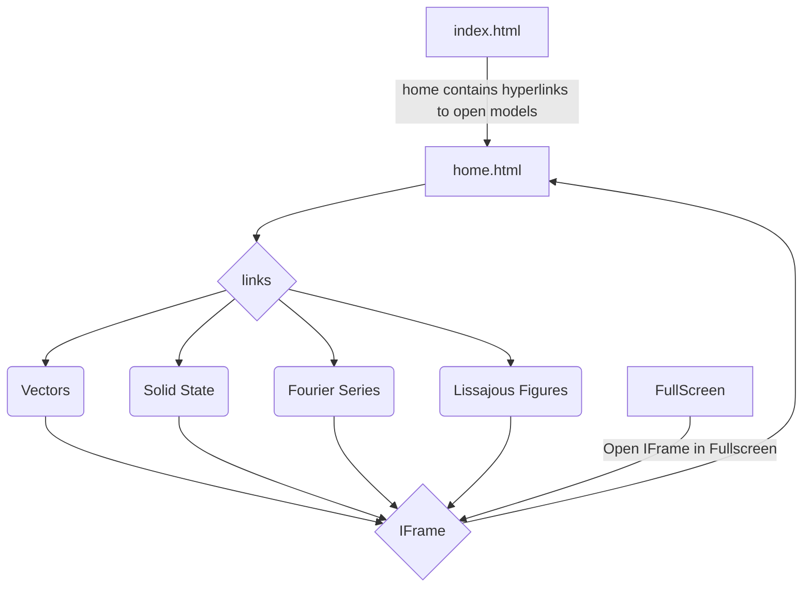

# Physics Models
## Interactive Visualizations for Understanding Complex Structures

[Link to the Project](https://vyasmokalzz.github.io/Physics-Models/)
> [!IMPORTANT]
> Project is not supported by Mobile Browsers.

## Table of Contents
- [Introduction](#Introduction)
  - [Overview](#Overview) 
  - [Motivation](#Motivation)
  - [Evolution from Processing to p5.js](#Evolution-from-Processing-to-p5.js)
  - [Incorporating 3D Graphics with WEBGL](#Incorporating-3D-Graphics-with-WEBGL)
  - [Project Highlights](#Project-Highlights)
- [What is p5js and WEBGL](#What-is-p5js-and-WEBGL)
- [Structure of Project](#Structure-of-Project)
  - [Flowchart](#Flowchart)
  - [Vector Fields](#Vectors-Fields)
- [References](#References)

## Introduction
### Overview
This project is born out of a passion for combining the power of coding with the beauty of physics. Inspired by the enlightening approach of 3Blue1Brown [[1](https://www.youtube.com/@3blue1brown)] and the capabilities of p5.js, this endeavor seeks to bridge the gap between static 3D images and a deep understanding of complex structures.

### Motivation
In physics, the power of visualization cannot be overstated. Traditional static images often fall short in conveying the intricacies of crystal structures, vector fields, 3D functions and other concepts. Recognizing this limitation during a solid state physics lecture, I embarked on a coding journey initially for the sheer joy of learning and exploring.

### Evolution from Processing to p5js
Having previously created a simple cubic model using Processing, the project gradually evolved as I discovered the versatility of p5.js, a JavaScript library designed for drawing and animations. What made it even more appealing was its compatibility with any web browser, eliminating the need for specific software installations.

### Incorporating 3D Graphics with WEBGL
The incorporation of WEBGL in p5.js opened up exciting possibilities for creating intricate 3D crystal structures. The project has successfully transitioned from a static representation to an interactive and dynamic experience, allowing users to explore and understand complex physical phenomena effortlessly.

### Project Highlights
The project currently encompasses an array of interactive models, including Crystal Structures, Voids, Miller Indices, Fourier Series, Vector Functions, and Larmor Precession. The aim is to visualize these concepts and provide an engaging platform for learning and exploration.

## What is p5js and WEBGL
p5.js [[2](https://p5js.org/)] is a free and open-source JavaScript library for creative coding, with a focus on making coding accessible and inclusive for artists, designers, educators, beginners, and anyone else!

WebGL [[3](https://p5js.org/learn/getting-started-in-webgl-coords-and-transform.html)], or Web Graphics Library, is a JavaScript API (Application Programming Interface) that enables the rendering of 3D and 2D graphics within web browsers. It provides a bridge between the browser and the computer's GPU (Graphics Processing Unit), allowing for hardware-accelerated graphics rendering.

A basic p5.js program incorporating WEBGL looks like this:
```javascript
function setup() {
  createCanvas(windowWidth, windowHeight, WEBGL);
  describe('a red box on a white background');
}

function draw(){
  background(255);
  fill(255,0,0);
  box();
}
```
One of the most fundamental differences between working in 2D and working in 3D is the most obvious: there is one more dimension to work with. In addition to the horizontal and vertical position (x and y axes) of an element in our drawing, 3D adds depth, the z-axis.

When drawing in 2D, the point (0,0) is located at the top left corner of the screen. In WebGL mode, the origin of the sketch (0,0,0) is located in the middle of the screen. By default, the x-axis goes left-to-right, y-axis goes up-to-down, and the z-axis goes from further-to-closer.
<div align = "center">
  
</div>

## Structure of Project
### Flowchart

### Vector Fields
Vector fields are a cornerstone of Physics, representing crucial concepts that often pose visualization challenges, especially in comparison to scalar fields. To address this hurdle, our project integrates a sophisticated vector field plotter capable of rendering both 2D and 3D vector fields with clarity and precision. While existing platforms like Geogebra[[4](https://www.geogebra.org/m/u3xregNW)], Desmos[[5](https://www.desmos.com/calculator/ixxmfu8pbj)], and Matlab offer similar functionalities, they often fall short in effectively portraying vector field strengths, resulting in cluttered visualizations. Matlab does offer a strength-based color plotter, but it requires purchasing the software and navigating through coding complexities.

In contrast, our project offers an intuitive solution by employing color mapping to represent vector field strengths, resulting in cleaner and more insightful visualizations. What sets our project apart is its accessibility - it can be accessed and utilized on any device equipped with a standard web browser. By providing a user-friendly interface and eliminating the need for additional software purchases or coding expertise.

The project started with basic P5.js code incorporating WEBGL. Next task was to plot axes, WEBGL by default offer the left handed vector system, hence all plotted field are in left handed coordinate system. A crucial part of the project was to make an orbit function which can provide with third person camera to make the model interactive.

<div>
  Program just after the mentioned steps:
  
</div>

Next Task was to create an Arrow object which will plot an arrow at the desired location to specify the direction of the field at that point. P5.js has cone and cylinder functions which makes the job much easier.
```javascript
cone([radius], [height], [detailX], [detailY], [cap]);
cylinder([radius], [height], [detailX], [detailY], [bottomCap], [topCap]);
```
Together with translate function we can easily make an arrow as shown above. The orientation of the arrow at point can be set by using rotateZ() and rotateX() whose offset can be determined by the field functions.
<div>
  
</div>

Next to plot a field many arrow objects would be needed, hence 2D and and 3D arrays are used, and on each location of the array an arrow object is stored the location, fields component wise magnitude and orientation angle are all stored in arrow object.
<div>
  
</div>
Now most important task was to add colors to the arrows. What makes it complicated is to assign color
## References
1. https://www.youtube.com/@3blue1brown
2. https://p5js.org/
3. https://p5js.org/learn/getting-started-in-webgl-coords-and-transform.html
4. https://www.geogebra.org/m/u3xregNW
5. https://www.desmos.com/calculator/ixxmfu8pbj
